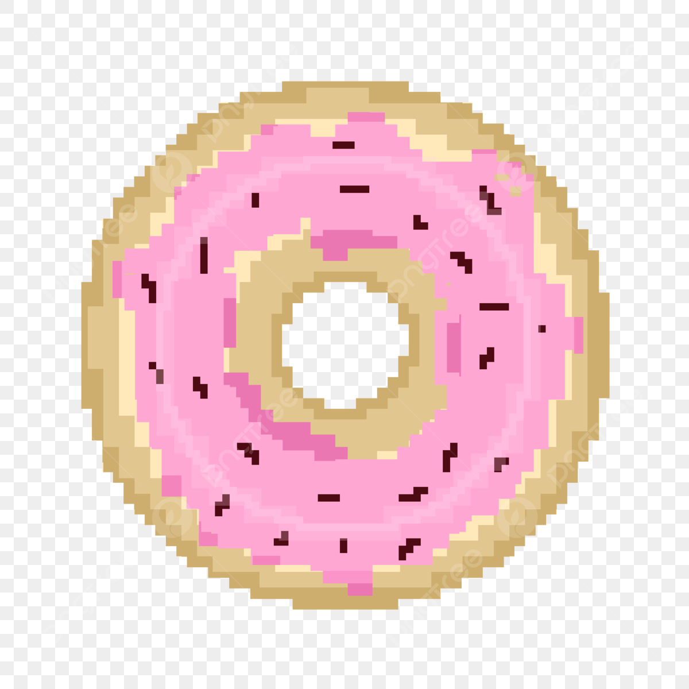

# ~~cookie-clicker~~ [Donut-clicker](https://marinevh.github.io/cookie-clicker/cookie-clicker/ "Donut-Clicker")

## _Contexte :_

Ce projet de **Coockie Clicker** est réalisé dans le cadre de la formation de **Web-Developper-Junior** chez [BeCode](https://becode.org/all-trainings/pedagogical-framework-junior-developer/ "BeCode")

## _Equipe :_

- ***Marine*** : Project-Manager
- ***Audrius*** : Back-End dev
- ***Cédric*** : Front-End Dev

## _Consignes :_

### Objectifs :

- Compétences JavaScript
- compétences d'équipe
- compétences en matière de conflit git

### Mission :

Ce défi vous demandera de créer un cookie clicker en équipe. Suivez les instructions pour relever le défi, pour avoir quelques idées, consultez les exemples dans la section ressources .

### Fonctionnalités :

Fonctionnalités/instructions indispensables
**!! Remarque : Les étapes ci-dessous sont destinées à vous aider dans le développement, mais tant que vous créez un cookie clicker, vous pouvez implémenter ce que vous voulez !! **

### Étape 1 : structure de base :

Écrivez la structure de base du projet en HTML , CSS et JavaScript . Dans le HTML, placez un bouton clic qui incrémentera un compteur et un label initialisé à 0 pour afficher ledit compteur.

### Étape 2 : préparer le JavaScript :

Dans votre JavaScript, préparez des variables pour vous permettre de contrôler votre bouton et votre étiquette. Vous aurez également besoin d'une variable pour suivre le score.

### Étape 3 : augmenter le score :

Lorsque vous cliquez sur le bouton, augmentez la variable stockant le score de 1 , puis affichez le score actuel à l'intérieur de l'étiquette.

### Étape 4 : faire un multiplicateur :

Ajoutez un autre bouton qui fera office de multiplicateur. Lorsqu'il est appelé, ce bouton multipliera en permanence le nombre de points par clic, par deux par exemple.

### Étape 5 : prix du multiplicateur :

Le multiplicateur permet d'avoir un gros score rapidement, cela ne devrait pas être gratuit, il devrait s'agir d'un achat effectué avec le score actuel du joueur.

### Étape 6 : pas de crédit :

Vous ne pouvez pas faire de crédit, ce qui signifie que le joueur ne peut pas avoir un score négatif. Pensez à mettre à jour l'affichage des scores après un achat.

### Étape 7 : afficher le compteur multiplicateur :

Affichez le compteur dans le multiplicateur. Par exemple, si le compteur vaut 5 , alors le bouton devrait afficher quelque chose comme multiplicateur x5 .

### Étape 8 : augmenter le coût :

Acheter beaucoup de multiplicateurs est bien trop facile. Pour plus de plaisir, faites en sorte que chaque fois qu'un multiplicateur est acheté, le coût d'achat d'un nouveau augmente.

### Étape 9 : afficher le coût :

Dans le texte du bouton multiplicateur, vous devriez également avoir le prix de la mise à niveau.

### Étape 10 : clic automatique :

Implémentez une nouvelle amélioration pour acheter, le clic automatique . Comme son nom l'indique, ce bonus ajoutera automatiquement un clic à votre score toutes les x secondes.

### Étape 11 : bonus :

Implémentez encore une autre amélioration pour acheter, le bonus . Cela devrait accorder au joueur une augmentation de score de 200 % par clic pendant 30 secondes . Lors de l'achat, le joueur devrait voir une minuterie avec le temps restant à l'intérieur du bouton bonus.

### Étape 12 : désactiver les boutons :

Faites en sorte que, si le joueur n'a pas les points nécessaires pour acheter un multiplicateur, un clic automatique ou un autre bonus, il ne puisse pas.

### Étape 13 : rendez-le joli :

Votre clicker de cookie doit être joli, donnez-lui une belle apparence avec CSS ou du JavaScript supplémentaire.

## _Livraison :_
1. Publiez votre code source sur le référentiel GitHub.
2. Pimpez le fichier Lisez-moi :
    - Quoi, pourquoi, quand, comment, qui.
    - En attendant des choses à faire
    - Il doit contenir un lien vers la version "live". La version « live » doit contenir un lien vers le code source sur GitHub.
3. Publiez le lien vers la version "live" sur Discord.

## _Thème :_

Nous avons decidé de faire un **Donut Clicker** 

## _Sources :_