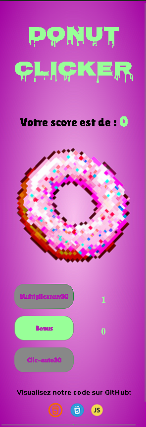
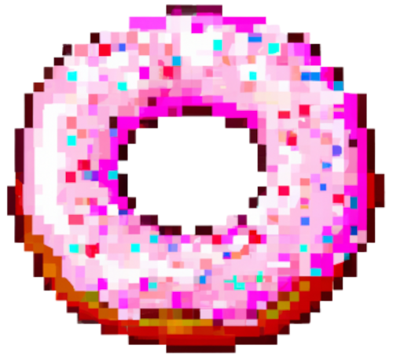
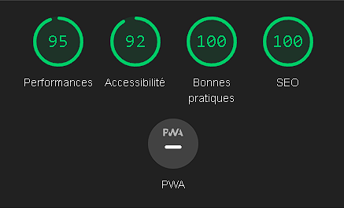

# ~~🍪 cookie-clicker 🍪~~ **NO** [🍩 Donut-clicker 🍩](https://marinevh.github.io/cookie-clicker/cookie-clicker/ "Donut-Clicker") 🤤

## _Contexte :_

Ce projet de **Coockie Clicker** est réalisé dans le cadre de la formation de **Web-Developper-Junior** chez [BeCode](https://becode.org/all-trainings/pedagogical-framework-junior-developer/ "BeCode"), selection **Swartz-8**.

## _Equipe :_

- ***[Marine](https://github.com/MarineVH "GitHub")*** : Project-Manager 👩‍💻 / Patronne de la **Patisserie** 👩‍🍳
- ***[Audrius](https://github.com/AudriusGrebliunas "GitHub")*** : Back-End dev 👨‍💻 / Le patissier qui a fait la pâte 👨‍🍳
- ***[Cédric](https://github.com/cebe0210 "GitHub")*** : Front-End Dev 🧑‍💻 / Le patissier qui a mis le nappage 🧑‍🍳

## _Mais qu'est-ce qu'un **cookie-clicker**?_

Un cookie clicker, c'est un de ces jeux en ligne super simples qui te rendent accro. L'idée, c'est de cliquer comme un fou sur un cookie à l'écran pour gagner des cookies virtuels. Au fil du temps, ça devient de plus en plus dingue avec des trucs compliqués qui te permettent de produire des cookies automatiquement et de te fixer des objectifs toujours plus fous.

Ce genre de jeu, ça appartient à la catégorie des "idle games", c'est-à-dire des jeux où t'as juste à les laisser tourner en arrière-plan et ils continuent à te filer des trucs, même quand tu ne les regardes pas. C'est génial pour sa simplicité et c'est tellement addictif que tu risques de te retrouver à y passer un temps fou. Des fois, on a même entendu des joueurs dire que ça les avait un peu rendus accros.

## _Code :_

- 

- 

- 

## _Consignes :_

### Objectifs :

- Compétences JavaScript
- compétences d'équipe
- compétences en matière de conflit git

### Mission :

Ce défi vous demandera de créer un cookie clicker en équipe. Suivez les instructions pour relever le défi, pour avoir quelques idées, consultez les exemples dans la section ressources .

### Fonctionnalités :

Fonctionnalités/instructions indispensables
**!! Remarque : Les étapes ci-dessous sont destinées à vous aider dans le développement, mais tant que vous créez un cookie clicker, vous pouvez implémenter ce que vous voulez !! **

### Étape 1 : structure de base : ✅

Écrivez la structure de base du projet en HTML , CSS et JavaScript . Dans le HTML, placez un bouton clic qui incrémentera un compteur et un label initialisé à 0 pour afficher ledit compteur.

### Étape 2 : préparer le JavaScript : ✅

Dans votre JavaScript, préparez des variables pour vous permettre de contrôler votre bouton et votre étiquette. Vous aurez également besoin d'une variable pour suivre le score.

### Étape 3 : augmenter le score : ✅

Lorsque vous cliquez sur le bouton, augmentez la variable stockant le score de 1 , puis affichez le score actuel à l'intérieur de l'étiquette.

### Étape 4 : faire un multiplicateur : ✅

Ajoutez un autre bouton qui fera office de multiplicateur. Lorsqu'il est appelé, ce bouton multipliera en permanence le nombre de points par clic, par deux par exemple.

### Étape 5 : prix du multiplicateur : ✅
 
Le multiplicateur permet d'avoir un gros score rapidement, cela ne devrait pas être gratuit, il devrait s'agir d'un achat effectué avec le score actuel du joueur.

### Étape 6 : pas de crédit : ✅

Vous ne pouvez pas faire de crédit, ce qui signifie que le joueur ne peut pas avoir un score négatif. Pensez à mettre à jour l'affichage des scores après un achat.

### Étape 7 : afficher le compteur multiplicateur : ✅

Affichez le compteur dans le multiplicateur. Par exemple, si le compteur vaut 5 , alors le bouton devrait afficher quelque chose comme multiplicateur x5 .

### Étape 8 : augmenter le coût : ✅

Acheter beaucoup de multiplicateurs est bien trop facile. Pour plus de plaisir, faites en sorte que chaque fois qu'un multiplicateur est acheté, le coût d'achat d'un nouveau augmente.

### Étape 9 : afficher le coût : ✅

Dans le texte du bouton multiplicateur, vous devriez également avoir le prix de la mise à niveau.

### Étape 10 : clic automatique : ✅

Implémentez une nouvelle amélioration pour acheter, le clic automatique . Comme son nom l'indique, ce bonus ajoutera automatiquement un clic à votre score toutes les x secondes.

### Étape 11 : bonus : ✅

Implémentez encore une autre amélioration pour acheter, le bonus . Cela devrait accorder au joueur une augmentation de score de 200 % par clic pendant 30 secondes . Lors de l'achat, le joueur devrait voir une minuterie avec le temps restant à l'intérieur du bouton bonus.

### Étape 12 : désactiver les boutons : ✅

Faites en sorte que, si le joueur n'a pas les points nécessaires pour acheter un multiplicateur, un clic automatique ou un autre bonus, il ne puisse pas.

### Étape 13 : rendez-le joli : ✅

Votre clicker de cookie doit être joli, donnez-lui une belle apparence avec CSS ou du JavaScript supplémentaire.

## _Livraison :_

1. Publiez votre code source sur le référentiel GitHub. ✅
2. Pimpez le fichier Lisez-moi :
    - Quoi, pourquoi, quand, comment, qui.
    - En attendant des choses à faire
    - Il doit contenir un lien vers la version "live". La version « live » doit contenir un lien vers le code source sur GitHub.✅
3. Publiez le lien vers la version "live" sur Discord.✅

## _Thème :_

Nous avons decidé de faire un **Donut Clicker** 🍩🍩🍩

**Version Desktop :**

**Version Mobile :**

Le donut à été généré avec [Dall-E](https://labs.openai.com/ "Dall-E") **Prompt** : *un donut rose avec des paillettes en pixel-art*

- Musique : Music by <a href="https://pixabay.com/fr/users/piemert-24353758/?utm_source=link-attribution&utm_medium=referral&utm_campaign=music&utm_content=171719">Robert de Waard</a> from <a href="https://pixabay.com//?utm_source=link-attribution&utm_medium=referral&utm_campaign=music&utm_content=171719">Pixabay</a>

- Le fond en dégrader à été généré avec [Colinkeany](http://www.colinkeany.com/blend/ "Colinkeany")

- Les polices de caractères ont été télécharger sur [Google-Fonts](https://fonts.google.com/ "Google-Fonts")

- Le pointeur de souris à été trouvé sur [Icons8](https://icons8.com/ "icons8")

## _Lighthousse :_

### Test lighthousse desktop : 

### Test lighthousse mobile :

